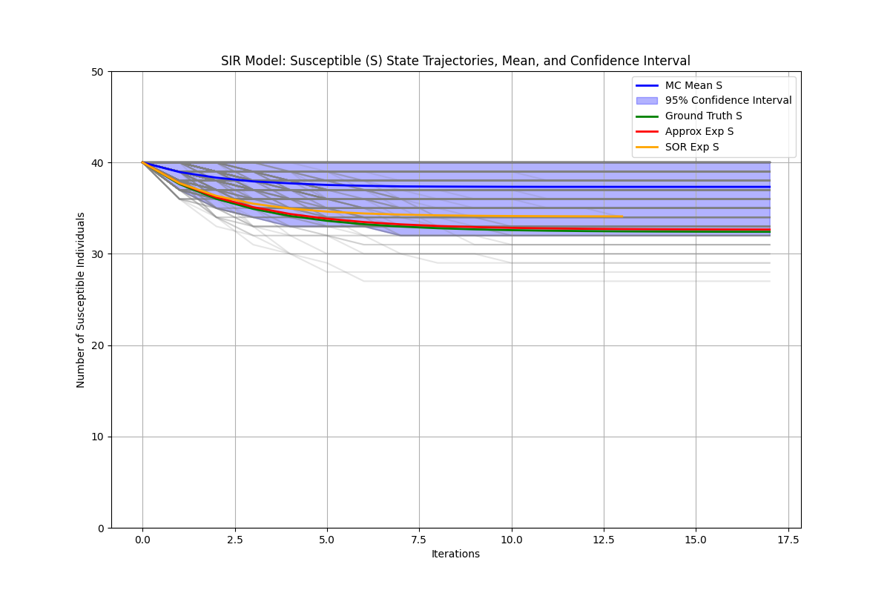

# Probabilistic Disease Spread on Directed Graph


This code is for my current project, which investigates the probabilistic spread of epidemics on directed graphs and derives the steady-state distribution for each individual in the network. Our goal is to demystify the spread process, approximate computationally intensive components using numerical methods, and accelerate the entire process through relaxation techniques. For simplicity, the epidemic spread is modeled using the SIR framework, with Monte Carlo simulations serving as the baseline for comparison.

## Evironment Setting

First create and activate the virtual evironment:

```bash
conda create -n epidemics python==3.10

source activate epidemics
```


Run the following to install dependencies:

```bash
pip install -r requirements.txt
```

Specificlly, for installation of `torch` and `PyG`:

```bash
pip install https://download.pytorch.org/whl/cu118/torch-2.4.1%2Bcu118-cp310-cp310-linux_x86_64.whl#sha256=740bae6eb10c6b41cb86c4f9e84da0b4533b5595aed4f06694d95d5e32b4076c
pip install pyg-lib -f https://data.pyg.org/whl/torch-2.4.0+cu118.html
pip install torch-geometric
pip install torch-scatter==2.1.2 -f https://data.pyg.org/whl/torch-2.4.1+cu118.html
```

## Execution

Simply run 

```bash
python main.py
```

Options for arguments can be accessed in `main.py`.


## Results

After execution of the code, there will generate a folder containing a trajectory plot



and a `.csv` table looks like

```
                          Metric         Value
0           Monte Carlo Time (s)  3.509154e+00
1          Ground Truth Time (s)  5.710840e-03
2         Approximation Time (s)  4.809856e-03
3            SOR Approx Time (s)  3.976583e-03
4   MC Average Convergence Steps  6.578000e+00
5           GT Convergence Steps  1.800000e+01
6       Approx Convergence Steps  1.800000e+01
7          SOR Convergence Steps  1.400000e+01
8          GT Final S Percentile  3.800000e+00
9      Approx Final S Percentile  3.800000e+00
10        SOR Final S Percentile  1.180000e+01
11                GT Kendall-Tau  8.219331e-01
12                    GT p-value  3.294221e-16
13            Approx Kendall-Tau  8.202331e-01
14                Approx p-value  3.787947e-16
15               SOR Kendall-Tau  8.219331e-01
16                   SOR p-value  3.294221e-16
```

which reveal our analysis of result.


## To-do List

- [x] Change Monte Carlo simulation to multi-thread processing.
- [ ] Implement on large directed networks.
- [ ] Explore on the effect of initial infected set.